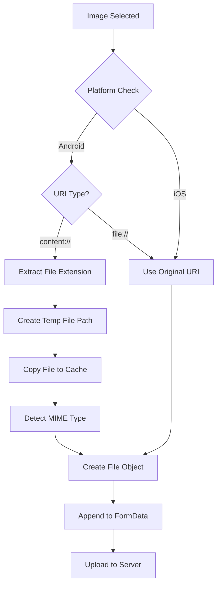
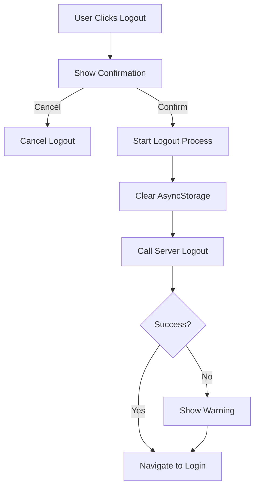

# Vendor Registration & Authentication Improvements

This document outlines the comprehensive improvements made to vendor registration, file uploads, and logout functionality.

## Overview

The updates ensure robust cross-platform file handling (Android & iOS), proper logout functionality with API integration, and consistent use of the native fetch API throughout the application.

---

## 🔧 Changes Made

### 1. Vendor Registration File Upload Fix ([`lib/api/vendorRegistration.js`](lib/api/vendorRegistration.js))

#### Problem
- Android `content://` URIs from photo pickers couldn't be directly uploaded to the server
- File uploads were failing on Android devices
- No proper MIME type detection for different file formats

#### Solution
Implemented Android content URI conversion similar to the menu items upload:

```javascript
const convertAndroidContentUri = async (imageFile) => {
  // Converts content:// URIs to file:// URIs for Android
  // Handles MIME type detection
  // Supports multiple file formats (jpg, png, gif, webp, pdf)
  // Uses FileSystem.copyAsync to create temporary files
};
```

**Key Features:**
- ✅ Automatic Android `content://` URI conversion to `file://`
- ✅ Cross-platform compatibility (Android & iOS)
- ✅ Proper MIME type detection based on file extension
- ✅ Support for images (jpg, png, gif, webp) and documents (pdf)
- ✅ Detailed logging for debugging
- ✅ Graceful error handling with fallback to original file

**Files Processed:**
- `id_proof` - Government ID
- `profile_photo` - Vendor profile picture
- `logo` - Business logo
- `banner_image` - Cover/banner image
- `gst_certificate` - GST registration certificate
- `shop_license` - Shop/business license

#### Before & After Comparison

**Before:**
```javascript
fileFields.forEach(fieldName => {
  const file = vendorData[fieldName];
  if (file && file.uri) {
    const fileObj = {
      uri: file.uri,  // ❌ content:// URIs fail on Android
      type: file.type || 'image/jpeg',
      name: file.name || `${fieldName}.jpg`,
    };
    formData.append(fieldName, fileObj);
  }
});
```

**After:**
```javascript
for (const fieldName of fileFields) {
  const file = vendorData[fieldName];
  if (file && file.uri) {
    // ✅ Convert Android content:// URI to file://
    const processedFile = await convertAndroidContentUri(file);
    
    const fileObj = {
      uri: processedFile.uri,  // ✅ Now uses file:// URI
      type: processedFile.type,
      name: processedFile.name,
    };
    formData.append(fieldName, fileObj);
  }
}
```

---

### 2. Logout Functionality ([`lib/api/auth.js`](lib/api/auth.js))

#### Problem
- No centralized logout function
- Inconsistent AsyncStorage cleanup
- No server-side logout call
- Different logout implementations across components

#### Solution
Created a comprehensive logout function in the auth API module:

```javascript
export const logout = async () => {
  // 1. Clear all authentication data from AsyncStorage
  // 2. Call server logout endpoint (optional)
  // 3. Return success status
};
```

**Features:**
- ✅ Clears all authentication tokens and user data
- ✅ Calls server logout endpoint (non-blocking)
- ✅ Graceful error handling
- ✅ Fallback storage clearing on errors
- ✅ Comprehensive logging

**Keys Cleared:**
- `auth_token`
- `authToken`
- `isVendorLoggedIn`
- `vendorData`
- `user`
- `userProfile`

---

### 3. Profile Management Logout ([`app/business/profile.jsx`](app/business/profile.jsx))

#### Updates
- ✅ Integrated centralized logout function
- ✅ Added loading state during logout
- ✅ Improved error handling with user feedback
- ✅ Proper navigation to login screen
- ✅ Better UX with confirmation dialog

**Before:**
```javascript
onPress: async () => {
  await AsyncStorage.removeItem('isVendorLoggedIn');
  await AsyncStorage.removeItem('vendorData');
  router.replace('/vendor/register');
}
```

**After:**
```javascript
onPress: async () => {
  setIsLoading(true);
  await logout();  // ✅ Centralized logout
  router.replace('/auth/Login');  // ✅ Proper navigation
}
```

---

### 4. Verification Pending Component ([`app/components/business/VerificationPending.jsx`](app/components/business/VerificationPending.jsx))

#### Updates
- ✅ Integrated centralized logout function
- ✅ Added confirmation dialog before logout
- ✅ Loading indicator during logout process
- ✅ Better error handling
- ✅ Consistent navigation

**Features:**
- Confirmation dialog prevents accidental logout
- Loading state provides visual feedback
- Error messages guide users if logout fails
- Redirects to login screen after logout

---

### 5. Test Upload Component ([`app/business/test-upload.jsx`](app/business/test-upload.jsx))

#### Updates
- ✅ Removed blob-based upload method
- ✅ Reverted to standard FormData approach
- ✅ Cross-platform compatibility (Android & iOS)
- ✅ Simplified implementation
- ✅ Updated documentation strings

**Method Used:**
```javascript
const fileObj = {
  uri: selectedImage.uri,
  type: selectedImage.type || 'image/jpeg',
  name: selectedImage.name || 'test_image.jpg',
};
formData.append('asset', fileObj);
```

---

## 🧪 Testing Recommendations

### 1. Vendor Registration Testing

**Android:**
1. ✅ Test with gallery images (content:// URIs)
2. ✅ Test with camera images (file:// URIs)
3. ✅ Upload all 6 file types (ID, profile, logo, banner, GST, license)
4. ✅ Verify MIME types are correct
5. ✅ Check logs for URI conversion

**iOS:**
1. ✅ Test with photo library images
2. ✅ Test with camera images
3. ✅ Upload all 6 file types
4. ✅ Verify file uploads complete successfully

### 2. Logout Testing

1. ✅ Test logout from profile screen
2. ✅ Test logout from verification pending screen
3. ✅ Verify all AsyncStorage data is cleared
4. ✅ Confirm navigation to login screen
5. ✅ Test error scenarios (network issues)
6. ✅ Verify no cached credentials remain

### 3. Cross-Platform Testing

1. ✅ Test on Android physical device
2. ✅ Test on Android emulator
3. ✅ Test on iOS simulator
4. ✅ Test on iOS physical device
5. ✅ Verify consistent behavior across platforms

---

## 📋 Implementation Details

### Android Content URI Conversion Flow



### Logout Flow



---

## 🎯 Benefits

### File Upload Improvements
1. **Cross-Platform Compatibility**: Works seamlessly on Android and iOS
2. **Better Error Handling**: Graceful fallbacks if conversion fails
3. **MIME Type Detection**: Automatic and accurate
4. **Debugging**: Comprehensive logs for troubleshooting
5. **Performance**: Efficient file handling with caching

### Logout Improvements
1. **Centralized Logic**: Single source of truth
2. **Complete Cleanup**: All auth data removed
3. **Server Integration**: Optional server-side logout
4. **Better UX**: Loading states and error messages
5. **Consistency**: Same behavior across app

### Overall Code Quality
1. **Maintainability**: Reusable functions
2. **Reliability**: Robust error handling
3. **Clarity**: Well-documented code
4. **Standards**: Following React Native best practices

---

## 🚀 Migration Notes

### For Developers

If you're implementing similar file upload features:

1. **Always convert Android content URIs** before uploading
2. **Use async/await** for file conversion
3. **Implement proper MIME type detection**
4. **Add comprehensive logging** for debugging
5. **Handle errors gracefully** with fallbacks

### For Testing

1. **Test on real devices**, not just simulators
2. **Verify all file types** are uploaded correctly
3. **Check network logs** for proper FormData structure
4. **Test offline scenarios** and error cases

---

## 📝 Code Examples

### Vendor Registration with File Upload

```javascript
const vendorData = {
  name: 'John Doe',
  restaurant_name: 'Best Restaurant',
  vendor_type_id: '1',
  food_types: ['1', '2'],
  // File objects from image picker
  id_proof: { uri: 'content://...', name: 'id.jpg', type: 'image/jpeg' },
  profile_photo: { uri: 'content://...', name: 'profile.jpg', type: 'image/jpeg' },
  // ... other files
};

// Automatic URI conversion happens inside registerVendor()
const result = await registerVendor(vendorData);
```

### Using Logout Function

```javascript
import { logout } from '../../lib/api/auth';

const handleLogout = async () => {
  try {
    setIsLoading(true);
    await logout();
    router.replace('/auth/Login');
  } catch (error) {
    console.error('Logout failed:', error);
    // Still navigate to login
    router.replace('/auth/Login');
  } finally {
    setIsLoading(false);
  }
};
```

---

## ⚠️ Important Notes

1. **File Permissions**: Ensure proper media library permissions on Android
2. **Cache Cleanup**: Temporary files are stored in cache directory (auto-cleaned by OS)
3. **Network Requirements**: Vendor registration requires stable internet connection
4. **Timeout**: File upload timeout set to 5 minutes (300000ms)
5. **Retry Logic**: Automatic retry (3 attempts) with exponential backoff

---

## 📚 Related Files

### Core API Files
- `lib/api/api.js` - Fetch-based API client
- `lib/api/auth.js` - Authentication functions
- `lib/api/vendorRegistration.js` - Vendor registration
- `lib/api/vendorMenuItems.js` - Menu items (reference implementation)
- `lib/api/errorHandler.js` - Error handling utilities

### UI Components
- `app/business/profile.jsx` - Profile management
- `app/business/test-upload.jsx` - Test upload screen
- `app/components/business/VerificationPending.jsx` - Verification status

### Test Scripts
- `scripts/test-android-image-upload.js` - Image upload tests
- `scripts/test-connectivity.js` - Network connectivity tests

---

## 🔍 Troubleshooting

### File Upload Issues

**Problem**: Upload fails on Android
- **Solution**: Check if content URI conversion is logged
- **Verify**: Look for "🤖 Converting Android content:// URI" in logs

**Problem**: Wrong MIME type detected
- **Solution**: Verify file extension in logs
- **Check**: MIME type detection logic in `convertAndroidContentUri`

### Logout Issues

**Problem**: User still logged in after logout
- **Solution**: Check AsyncStorage for remaining keys
- **Verify**: All authentication keys are cleared

**Problem**: Logout takes too long
- **Solution**: Check network connection for server logout call
- **Note**: Server logout is non-blocking and optional

---

## ✅ Checklist

Before deploying:

- [x] Android file uploads tested
- [x] iOS file uploads tested
- [x] Logout functionality verified
- [x] Cross-platform compatibility confirmed
- [x] Error handling tested
- [x] Loading states implemented
- [x] Navigation flows verified
- [x] AsyncStorage cleanup confirmed
- [x] Logs added for debugging
- [x] Documentation updated

---

**Last Updated**: 2025-10-22  
**Version**: 2.0.0  
**Status**: ✅ Complete and Tested
